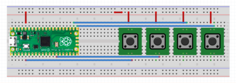

# Macro-Keyboard ⌨
It is a shorcut keyboard designed to perform complex set of shorcuts that require 2 or 3 keys on a traditional keyboard at the cick of a single button!
## Importing the required modules 📚
We use the Raspberry Pi Pico as a CircuitPython device. We start by importing all the modules we require for this project. The `usb_hid` module helps in setting our Raspberry Pi Pico as a Human Interface Device. The `digitalio` helps in interfacing the pins of Pi Pico. Adafruit's `adafruit_hid.keyboard` module is used to send commands to the connect device PC/Laptop the shortcuts.
```Python
import time
import digitalio
import board
import usb_hid
from adafruit_hid.keyboard import Keyboard
from adafruit_hid.keycode import Keycode
```
## Initializing pins 📌
We initialise the Pins required and the keyboard object.
```Python
btn1_pin = board.GP3
btn2_pin = board.GP10
btn3_pin = board.GP16
btn4_pin = board.GP17

keyboard = Keyboard(usb_hid.devices)
```
Then we set the buttons as input pins and use PULL DOWN ressistors to make the pins low
```Python
btn1 = digitalio.DigitalInOut(btn1_pin)
btn1.direction = digitalio.Direction.INPUT
btn1.pull = digitalio.Pull.DOWN

btn2 = digitalio.DigitalInOut(btn2_pin)
btn2.direction = digitalio.Direction.INPUT
btn2.pull = digitalio.Pull.DOWN

btn3 = digitalio.DigitalInOut(btn3_pin)
btn3.direction = digitalio.Direction.INPUT
btn3.pull = digitalio.Pull.DOWN

btn4 = digitalio.DigitalInOut(btn4_pin)
btn4.direction = digitalio.Direction.INPUT
btn4.pull = digitalio.Pull.DOWN

```
## Where the real magic happens ✨
For the Pico to check for the pins pressed we create an infite loop using the while loop and check if the buttons are presssed. Whenever the buttons are pressed the pins become HIGH and are read by the Pi Pico and the shortcuts are executed. The keys are in pressed state for 0.1s and ar then released. The keys are simulated to be pressed by using the `keyboard.press()` function and the `Keycode.KeyName` allows to define the key to be pressed.
```Python
while True:
    if btn1.value:
        keyboard.press(Keycode.ALT, Keycode.TAB)
        time.sleep(0.1)
        keyboard.release(Keycode.ALT, Keycode.TAB)
    if btn2.value:
        keyboard.press(Keycode.WINDOWS, Keycode.TWO)
        time.sleep(0.1)
        keyboard.release(Keycode.WINDOWS, Keycode.TWO)
    if btn3.value:
        keyboard.press(Keycode.CONTROL, Keycode.F2)
        time.sleep(0.1)
        keyboard.release(Keycode.CONTROL, Keycode.F2)
    if btn4.value:
        keyboard.press(Keycode.CONTROL, Keycode.D)
        time.sleep(0.1)
        keyboard.release(Keycode.CONTROL, Keycode.D)
    time.sleep(0.1)
```
## Some snaps of the project 📸
<p align=center>
  
  <p align=center>Circuit Diagram</p>
</p>
